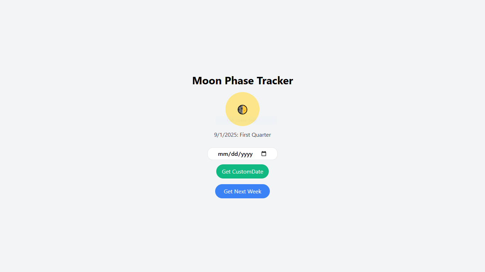

# 🌙 Moon Phase Tracker

[](https://docs.apiverve.com/ref/moonphases/)

Welcome to **Moon Phase Tracker**!  
A simple and interactive web app to track the current phase of the moon.  
Created for the μLearn x NASA mentorship pre-selection task.

---

## 🚀 Preview

Take a look at the live Moon Phase Tracker here:  
### [🌐 It's Live](https://shiyyaas.github.io/Moon-Phase-Tracker)



---

## ✨ Features

- 🌓 **Moon Phase Tracking:** Instantly see the current phase of the Moon for today.
- 📅 **Web-Based:** No installation needed. Just open and use!
- 🌑 **Clean UI:** User-friendly and visually appealing interface.
- 📆 **Custom Date Lookup:** Enter any date to see the moon phase for that day.
- 🔮 **Next 7 Days Forecast:** Get the moon phases for the upcoming week with a single click.
- 🚨 **Error Handling:** Friendly error messages for invalid requests or network issues.
- 🎉 **Responsive Design:** Mobile-friendly and works across devices.
- 🐾 **Loading Animations:** Enjoy a fun loading animation while fetching data.

---

## 🌐 API Used

This project uses the [Apiverve Moon Phases API](https://docs.apiverve.com/ref/moonphases/)  
to fetch accurate and real-time moon phase data.  

---

## 📂 Getting Started

```bash
# 1. Clone the repo
git clone https://github.com/shiyyaas/Moon-Phase-Tracker.git

# 2. Open in your browser
# Just double-click Index.html or open it in your favorite browser
```

---

## 🤝 Contributing

Feel free to fork this repo and submit pull requests for improvements and new features!

---

## 🛰️ License

This project is licensed under the [MIT License](LICENSE).

---

> _Made with ❤️ for the μLearn x NASA mentorship pre-selection._
